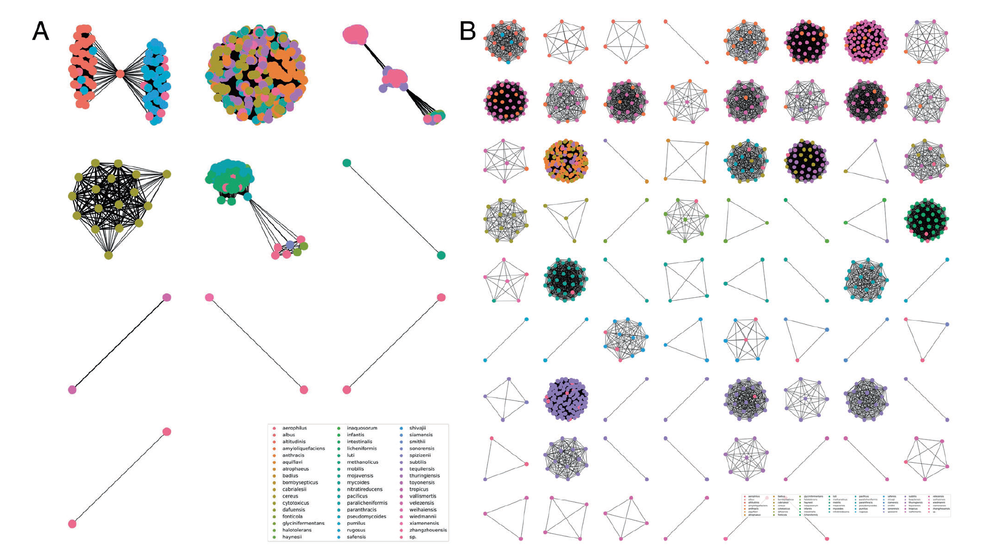
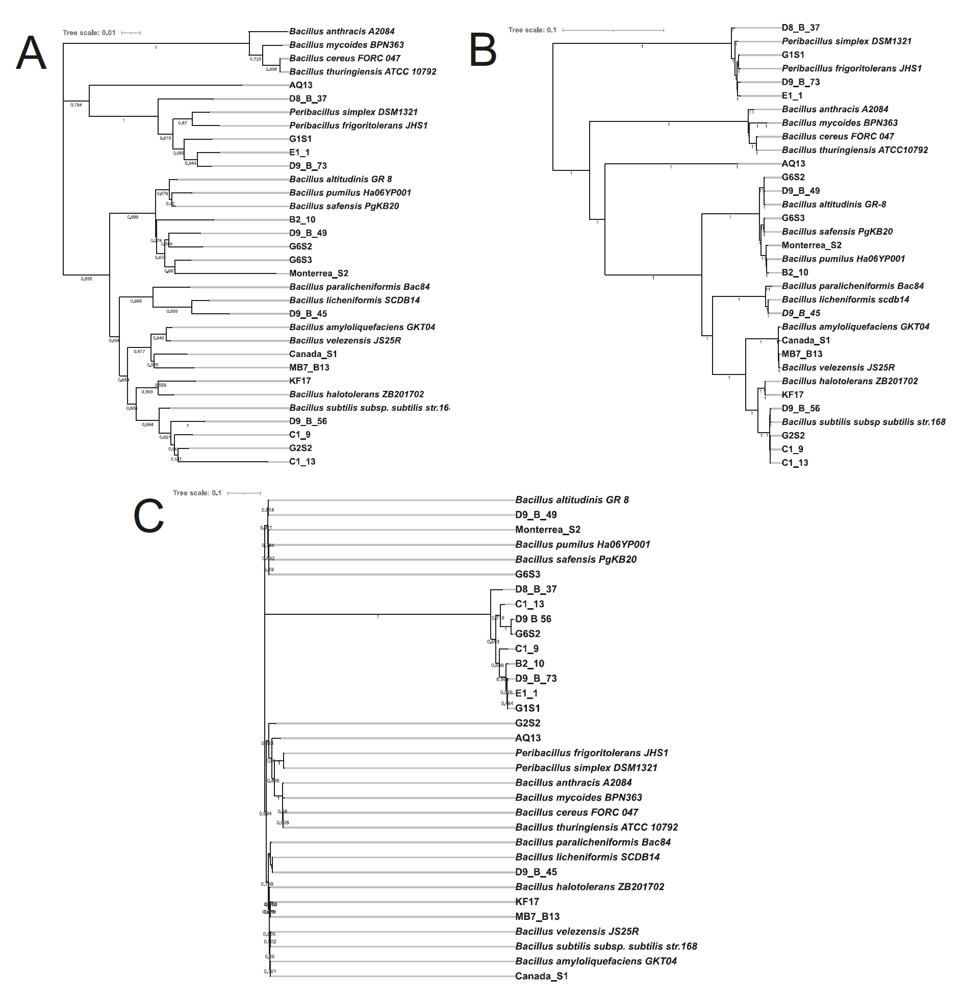

<h1 align="center">Enhanced Metataxonomic Resolution of Bacilli</h1>

By comparing conserved genomic regions followed by variable regions across all known genomes of the *Bacillus* genus, we have identified a primer pair that not only covers all species within this genus but also accurately distinguishes those species from each other. This advancement is particularly useful for the so-called "needle-versus-haystack" method, where a specific genus is investigated in greater detail than what is possible with 16S rRNA in metataxonomic studies of environmental DNA (eDNA) from soil.

### Highlights
- **In silico PCR Database Coverage of the New Primer Pair**: The newly identified primer pair, tuf2, successfully produces amplicons for 100% of 1,149 publicly available genomes of the *Bacillus* genus and 0% of 41 non-*Bacillus* genomes from species commonly found in soil.

- **In Vitro PCR-Based Metataxonomics**: Amplicons obtained from in vitro PCR using the tuf2 primer pair recapitulate a phylogeny similar to that based on multiple loci across the full genome. This method describes the species composition of a *Bacillus* DNA mix more accurately than any other known primer pairs designed for this purpose.

### Visual Documentation

*Figure 1: Clusters of similar in silico-derived amplicons colored by the actual species from which they were derived. **A**, standard 16S rRNA V3-V4 targeting primer pair-derived amplicons clustered by similarity show a low total number of clusters with many different species in each. **B**, tuf2 primer pair-derived amplicons cluster into many distinct groups with mostly a distinct species in each.*

*Figure 2: Phylogenies based on in vitro PCR-derived amplicons from the tuf2 or 16S rRNA V3-V4 primer pairs compared with a whole genome multi-locus phylogeny. **A**, Phylogenetic tree based on sequenced tuf2 PCR-derived amplicons. **B**, Whole genome multi-locus phylogenetic tree. **C**, phylogenetic tree based on sequenced 16S rRNA V3-V4 primer pair-derived amplicons. The tree constructed from the alignment of the tuf2-derived amplicons corresponds better with the whole genome multi-locus tree than that based on the amplicons from the 16S rRNA V3-V4 primer pair.*

*Figure 3: Relative abundance and identity of PCR amplicons from a Bacillus DNA mix. The tuf2-based amplicons correctly identified DNA from 9 out of 11 species in the DNA mix. That number was 8 out of 11 species for gyrA, a primer pair specifically designed for delineating species of the Bacillus subtilis species complex, which includes many of the species included. 16S rRNA V3-V4 derived amplicons could identify 4 out of 11 species.*

### Conclusion
This study exemplifies how new bioinformatic tools and the continual refinement of public databases have greatly improved the design of primers for metataxonomic studies.

For a more detailed description of this project, including a thorough introduction to the significance of the *Bacilli*, a project spearheaded and carried out by Xinming Xu, PhD, please check out our paper in ISME Communications [X. Xu et al. 2023](https://www.nature.com/articles/s43705-023-00330-9).
