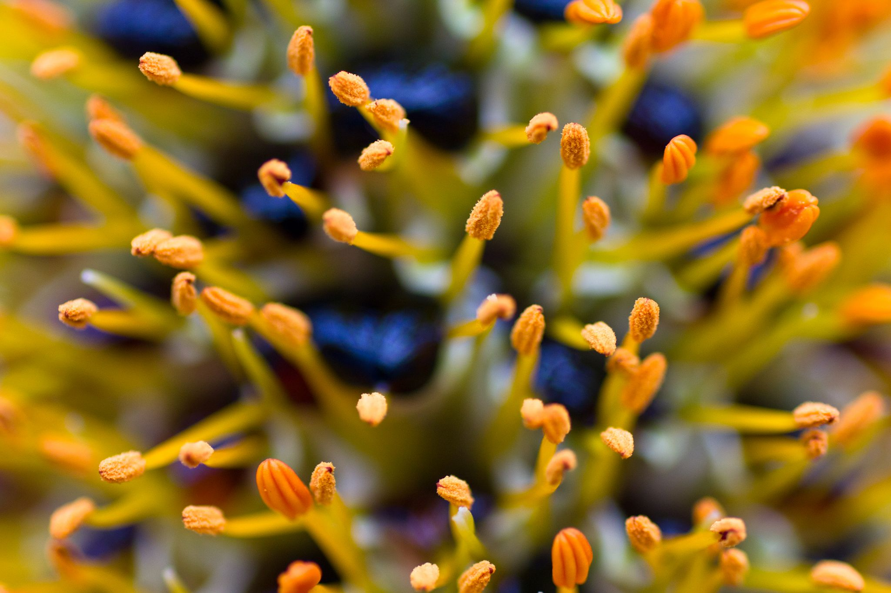

---
# Feel free to add content and custom Front Matter to this file.
# To modify the layout, see https://jekyllrb.com/docs/themes/#overriding-theme-defaults

layout: home
title: BioDiversiConomy
---
  BioDiversiConomy focuses on fostering financial incentives for nature
  conservation and restoration, while widely democratizing access to
  biotechnologies. It aims to enhance biological diversity through community
  participation and open-source principles, distinctively acknowledging the
  complex interplay between technological advancements and environmental
  sustainability.

  
  